<div align="center">

# 钻孔裂隙识别与三维重构

### Borehole Fracture Reconstruction

**面向钻孔成像资料的裂隙识别、几何表征、粗糙度量化与三维网络重构工具**


[项目简介](#项目简介) · [总体流程](#总体流程) · [四项功能](#四项功能) · [安装](#安装) · [快速开始](#快速开始) · [输出结构](#输出结构) · [技术文档](#技术文档)

</div>

---

## 项目简介

本项目把钻孔孔壁展开图转换为裂隙实例和物理参数，再结合多孔空间位置分析潜在的跨孔关联，生成空间不确定性分布与补充钻孔位置排序。

- **输入**：孔壁展开图、图像清单（孔径、深度区间、周向方位）、钻孔孔口位置与孔深。
- **输出**：裂隙掩码、正弦几何参数、Z2/JRC 粗糙度、三维裂隙平面、连接评分、体素不确定性和补孔排序，均为可审查的 CSV、PNG 与 JSON 文件。
- **入口**：命令行 `borehole-fracture`。`run` 连续执行四项功能，`segment`、`characterize`、`roughness`、`reconstruct` 可以单独调用，`train`、`evaluate` 用于 U-Net 训练和掩码评价。

| 需求 | 模块 | 命令 | 主要输出 |
| --- | --- | --- | --- |
| [① 裂隙识别与连续性增强](#seg) | `segmentation` | `segment` | 原始掩码、增强掩码、图像叠加 |
| [② 裂隙聚类与几何参数提取](#geo) | `geometry` | `characterize` | 裂隙实例、中心线轮廓、振幅 / 相位 / 中心深度 |
| [③ 粗糙度量化与采样分析](#rough) | `roughness` | `roughness` | Z2、JRC、采样方法对比、密度敏感性 |
| [④ 三维重构与勘探规划](#recon) | `reconstruction` | `reconstruct` | 三维平面、跨孔连接评分、不确定性场、补孔排序 |

## 总体流程

<p align="center">
  <a href="docs/assets/flow-overview.svg">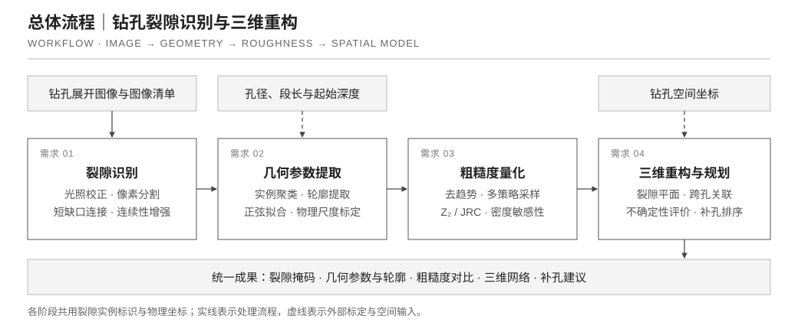</a>
</p>

四个阶段共用实例标识 `fracture_id`、物理坐标和参数表。实线箭头为主处理顺序，虚线箭头为外部输入。
每个阶段都把结果写成文件，可以编辑掩码或筛选参数表后，从对应阶段重新执行。

## 四项功能

每节包含一张模块流程图和钻孔图像分析案例图。案例图用于直观说明各模块的输出形态，图中数值仅对应该案例。

<a id="seg"></a>

### ① 裂隙识别与连续性增强

<p align="center">
  <a href="docs/assets/flow-segmentation.svg">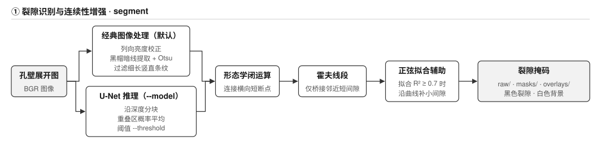</a>
</p>

默认使用经典图像处理：校正列向亮度后提取局部暗线，并过滤细长的竖直条纹；传入 `--model` 时改用 U-Net，沿深度分块推理并平均重叠区概率。
两条路径共用连续性增强：形态学闭运算、霍夫线段桥接邻近短间隙，以及在正弦拟合良好时沿曲线补小间隙。

<table align="center">
<tr>
<td width="44%" align="center">
  <a href="docs/assets/fracture-segmentation.jpg">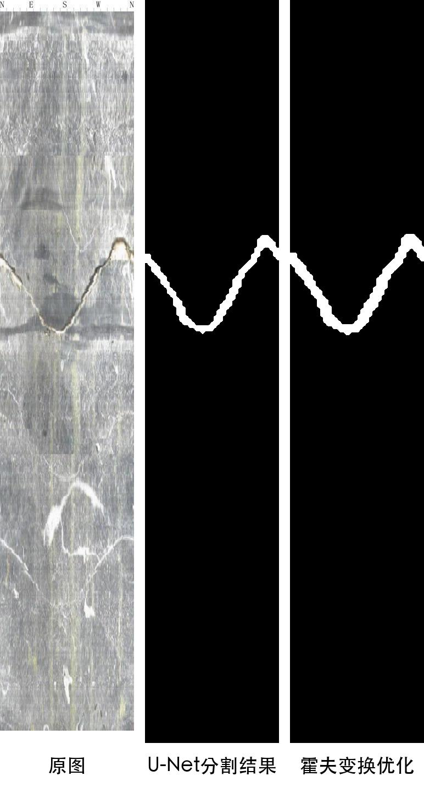</a>
</td>
<td>

**钻孔图像分析案例**

从左到右依次为孔壁展开原图、U-Net 分割结果和霍夫变换连续性优化结果。

图中以**白色显示裂隙**，这是案例的显示配色。`segment` 写出的掩码文件约定为**黑色裂隙、白色背景**，`overlays/` 中的叠加图则把裂隙像素染色后叠在原图上；读取或制作标签时请以文件约定为准。

</td>
</tr>
</table>

<a id="geo"></a>

### ② 裂隙聚类与几何参数提取

<p align="center">
  <a href="docs/assets/flow-geometry.svg">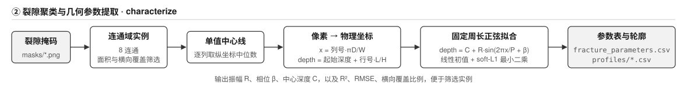</a>
</p>

平面裂隙与圆柱孔壁相交，展开后是一条周期等于孔周长的正弦曲线 `depth = C + R·sin(2πx/P + β)`。
每个连通域按列取中位数形成中心线，换算为毫米后以固定周长做稳健拟合，得到振幅 R、相位 β 和中心深度 C，并记录 R²、RMSE 与横向覆盖比例。

<p align="center">
  <a href="docs/assets/sinusoidal-fitting.png">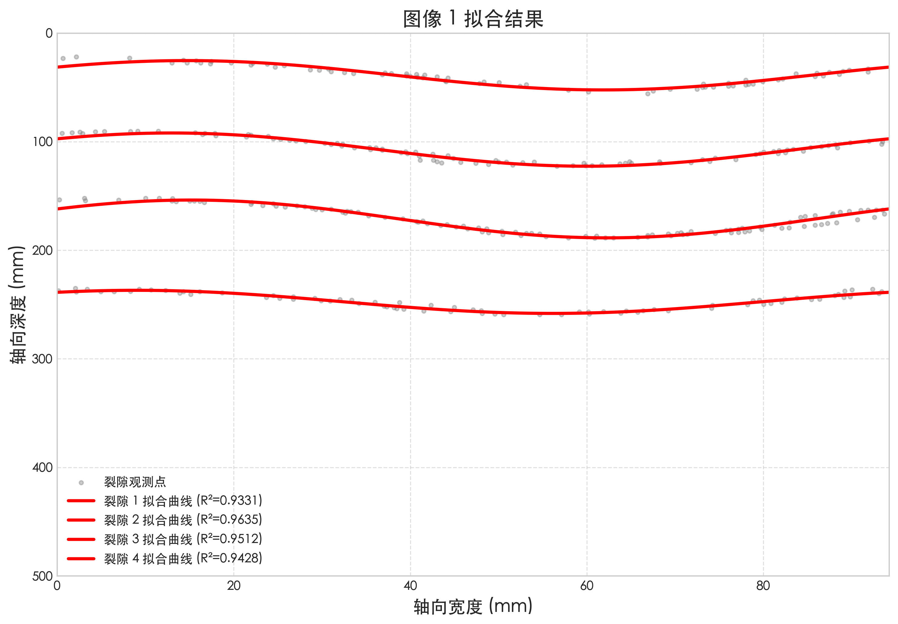</a>
</p>

<p align="center"><sub><b>钻孔图像分析案例</b>：同一幅展开图中四条裂隙的中心线观测点（灰点）与正弦拟合曲线（红线）。横轴为孔周展开宽度，纵轴为向下增加的深度。图例中的 R² 只描述这幅案例图中各条曲线的拟合情况。</sub></p>

<a id="rough"></a>

### ③ 粗糙度量化与采样分析

<p align="center">
  <a href="docs/assets/flow-roughness.svg">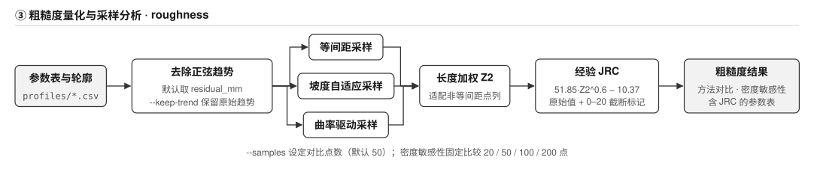</a>
</p>

默认对中心线相对正弦基线的残差计算粗糙度，把宏观倾斜与局部起伏分开（`--keep-trend` 保留原始趋势）。
三种采样方法在相同点数下比较，Z2 按区间长度加权以适配非等间距点列；JRC 同时保留经验原始值、0–20 范围值及截断标记。
结果反映图像中的轮廓形态，不能直接替代节理表面的实测粗糙度。

<p align="center">
  <a href="docs/assets/sampling-comparison.png">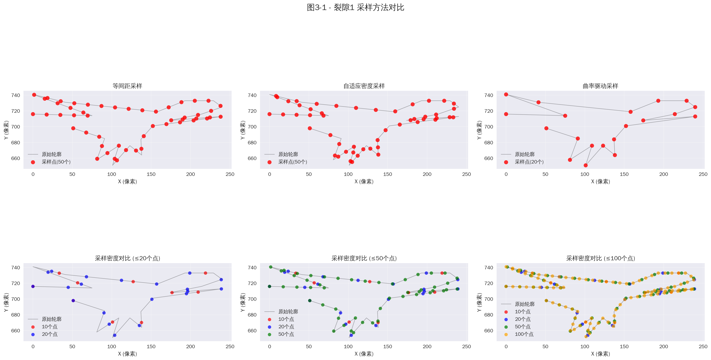</a>
</p>

<p align="center"><sub><b>钻孔图像分析案例</b>：上排为同一裂隙轮廓在等间距、自适应密度和曲率驱动采样下的点位分布，下排为不同采样点数对轮廓的覆盖。案例在裂隙轮廓边界（像素坐标）上采样，用于说明采样方式与密度的影响；<code>roughness</code> 命令对中心线去趋势残差采样，结果以表格输出。</sub></p>

<details>
<summary>案例：裂隙轮廓提取（原图、轮廓叠加与轮廓线）</summary>
<br>
<p align="center">
  <a href="docs/assets/contour-analysis.png">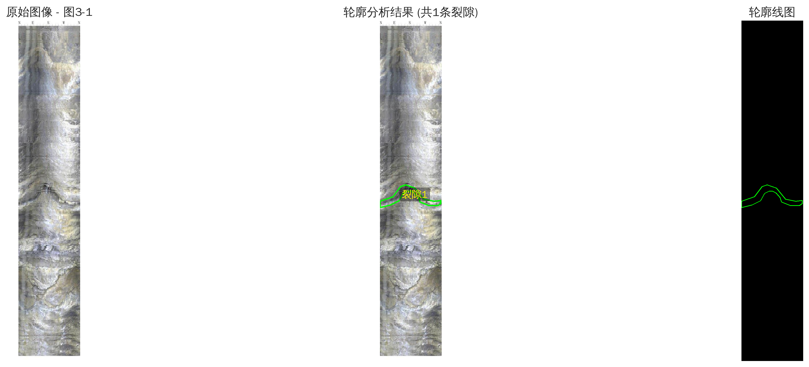</a>
</p>
<p align="center"><sub>从左到右为原始孔壁展开图、裂隙轮廓叠加结果和单独的轮廓线；上方采样对比即以这类轮廓为对象。</sub></p>
</details>

<a id="recon"></a>

### ④ 三维重构与勘探规划

<p align="center">
  <a href="docs/assets/flow-reconstruction.svg">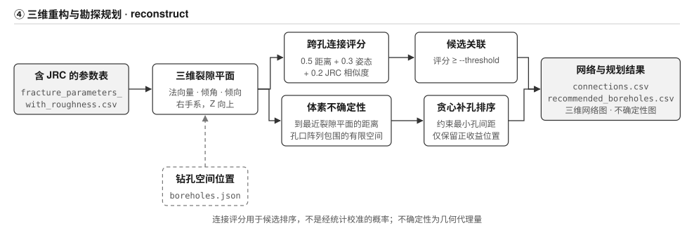</a>
</p>

由振幅、相位、中心深度和孔径推导裂隙平面的法向量、倾角与倾向，世界坐标为右手系、Z 向上。
不同钻孔的裂隙两两计算连接评分 `0.5×距离项 + 0.3×姿态相似 + 0.2×JRC 相似`，并输出每项贡献；评分用于候选排序，不是经统计校准的概率。
在孔口阵列包围的空间内，体素到最近裂隙平面的距离作为几何不确定性代理，按总体下降量贪心选择补孔位置，并约束最小孔间距。

<table>
<tr>
<td width="55%" align="center" valign="top">
  <a href="docs/assets/fracture-network-3d.png">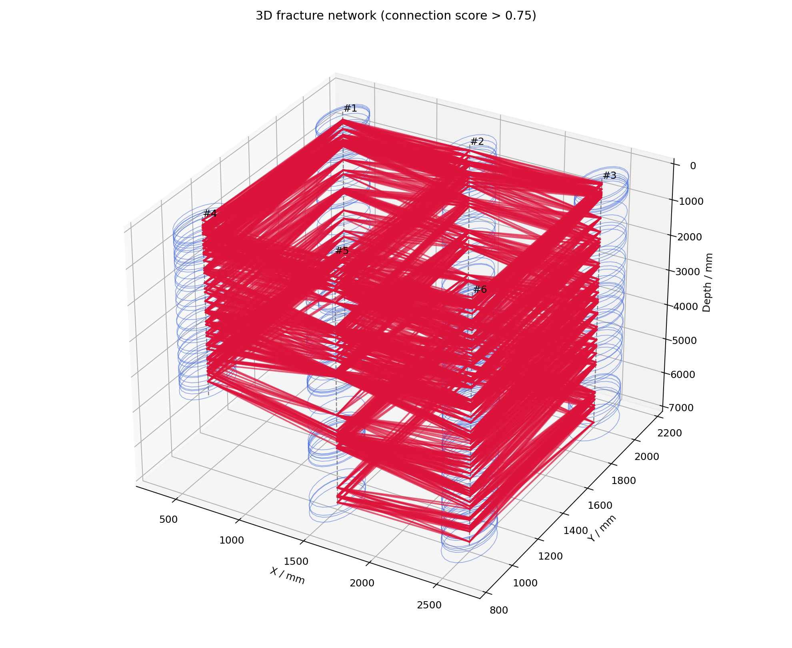</a>
  <br><sub><b>三维裂隙网络案例</b>：蓝色圆环表示各裂隙平面的姿态（显示半径仅用于可视化），红色连线为连接评分高于 0.75 的候选关联。本图纵轴按深度向下显示；图中 connection score 是排序评分，不是概率。</sub>
</td>
<td width="45%" align="center" valign="top">
  <a href="docs/assets/uncertainty-map.png">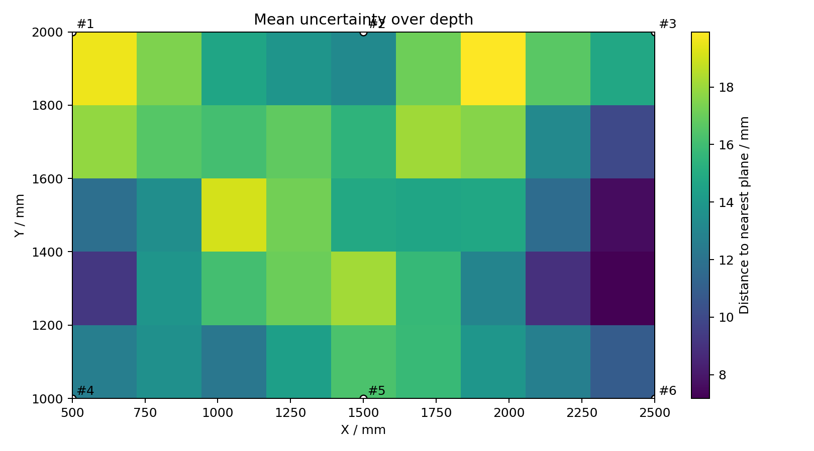</a>
  <br><sub><b>空间不确定性案例</b>：孔阵列平面内各位置沿深度平均的“到最近裂隙平面距离”，颜色越亮表示离已知裂隙平面越远，可用于比较补孔候选位置。</sub>
</td>
</tr>
</table>

## 技术栈

| 用途 | 依赖 |
| --- | --- |
| 数值计算与拟合 | NumPy · SciPy（`least_squares`，soft-L1 损失） |
| 图像处理 | OpenCV（形态学、Otsu、概率霍夫变换、连通域） |
| 参数表与输出 | pandas · Matplotlib |
| U-Net 训练与推理（可选） | TensorFlow / Keras，`pip install -e '.[training]'` |

## 安装

需要 **Python ≥ 3.10**。项目代码位于仓库内的 [`borehole-fracture-reconstruction/`](borehole-fracture-reconstruction/) 目录。

```bash
git clone https://github.com/mieyu/borehole-fracture-reconstruction.git
cd borehole-fracture-reconstruction          # 仓库根目录

cd borehole-fracture-reconstruction          # 项目目录（含 pyproject.toml）
python -m venv .venv
source .venv/bin/activate
python -m pip install -e .                   # 需要 U-Net 时：python -m pip install -e '.[training]'
```

## 快速开始

以下命令从仓库根目录开始；进入项目目录后，示例路径均相对于该目录。如果安装后已在项目目录，可省略下方的 `cd`。示例数据为合成数据，用于熟悉接口与输出格式。

**从参数表重构三维网络**（无需图像）：

```bash
cd borehole-fracture-reconstruction
borehole-fracture reconstruct examples/fracture_parameters.csv \
  --boreholes examples/boreholes.json --output outputs/network
```

**从图像执行完整流程**：先生成合成图像与清单，再连续运行四项功能。

```bash
cd borehole-fracture-reconstruction
python examples/generate_demo.py --output outputs/demo_input
borehole-fracture run outputs/demo_input/manifest.json \
  --boreholes outputs/demo_input/boreholes.json --output outputs/analysis
```

自有图像按 [数据接口](borehole-fracture-reconstruction/docs/data-contracts.md) 编写清单；加入 `--model models/fracture_unet.keras` 即选择 U-Net 推理路径。

<details>
<summary>按需求单独运行四个阶段</summary>

```bash
cd borehole-fracture-reconstruction
borehole-fracture segment outputs/demo_input/manifest.json --output outputs/segmentation
borehole-fracture characterize outputs/demo_input/manifest.json \
  --masks outputs/segmentation/masks --output outputs/geometry
borehole-fracture roughness outputs/geometry/fracture_parameters.csv \
  --samples 50 --output outputs/roughness
borehole-fracture reconstruct outputs/roughness/fracture_parameters_with_roughness.csv \
  --boreholes outputs/demo_input/boreholes.json --output outputs/reconstruction
```

`reconstruct` 的常用参数：`--threshold`（高评分阈值，默认 0.75）、`--distance-scale`（距离尺度 mm，默认 1500）、`--count`（补孔数上限，默认 3）、`--grid-xy` / `--grid-depth`（体素间距）、`--min-spacing`（最小孔间距）。

</details>

<details>
<summary>U-Net 训练与掩码评价</summary>

```bash
cd borehole-fracture-reconstruction
borehole-fracture train data/training_manifest.json --output models/unet
borehole-fracture evaluate outputs/segmentation/masks \
  --reference data/reference_masks --output outputs/evaluation.csv
```

训练清单格式见 [`training_manifest.example.json`](borehole-fracture-reconstruction/examples/training_manifest.example.json)。同一原图及其派生样本使用相同 `group_id`，按组划分训练集与验证集后再做成对增强。评价命令以裂隙前景计算 IoU 与 Dice。

</details>

## 输出结构

```text
outputs/analysis/
├── segmentation/     ① raw/、masks/（黑裂隙白背景）、overlays/、segmentation.json
├── geometry/         ② fracture_parameters.csv、profiles/*.csv
├── roughness/        ③ sampling_comparison.csv、density_sensitivity.csv、
│                        fracture_parameters_with_roughness.csv、profiles/
├── reconstruction/   ④ fractures_3d.csv、connections.csv、high_score_connections.csv、
│                        uncertainty_voxels.csv、highest_uncertainty_voxels.csv、
│                        recommended_boreholes.csv、summary.json、
│                        fracture_network_3d.png、uncertainty_map.png
└── run.json          本次流程的输入路径、模型与采样点数
```

**约定**：长度单位 mm、角度 rad（展示表中倾角、倾向为 deg）；图像行号与钻孔深度向下增加，世界坐标 Z 向上；
默认孔径 30 mm，三维方向需要图像左边界的方位标定 `azimuth_offset_rad`。
连接评分与补孔排序用于组织勘探资料和比较位置，现场决策需结合地质判读与施工约束。

## 技术文档

- [使用指南与命令](borehole-fracture-reconstruction/README.md)：安装、各命令示例与输出说明
- [需求与模块](borehole-fracture-reconstruction/docs/requirements.md)：四项需求的输入、输出与方法
- [数据接口与坐标约定](borehole-fracture-reconstruction/docs/data-contracts.md)：清单、钻孔表、参数表字段与连接评分公式
- [架构与处理流程](borehole-fracture-reconstruction/docs/architecture.md)：代码结构与阶段间数据交接
- [命令行入口](borehole-fracture-reconstruction/src/borehole_fracture/cli.py)

## 仓库结构

```text
borehole-fracture-reconstruction/            # 仓库根目录
├── borehole-fracture-reconstruction/        # Python 项目
│   ├── src/borehole_fracture/
│   │   ├── segmentation/    ① 裂隙识别、后处理、训练与评价
│   │   ├── geometry/        ② 连通域、中心线与正弦拟合
│   │   ├── roughness/       ③ 三种采样与 Z2/JRC
│   │   ├── reconstruction/  ④ 三维平面、连接评分、补孔规划与绘图
│   │   ├── workflows.py     阶段编排
│   │   └── cli.py           命令入口
│   ├── examples/            合成示例数据与清单模板
│   ├── docs/                技术文档
│   └── pyproject.toml
└── docs/assets/             首页流程图与案例图
```
