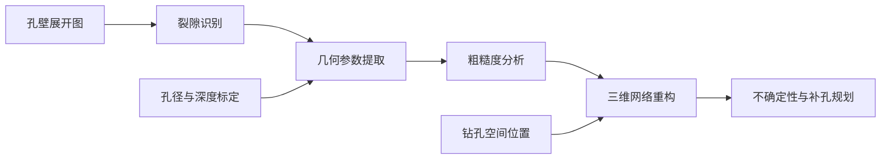

# Borehole Fracture Reconstruction

钻孔成像裂隙识别、几何表征与三维网络重构项目。输入孔壁展开图与钻孔空间位置，输出裂隙掩码、几何参数、粗糙度、三维网络和补充钻孔排序。

## 项目需求

| 需求 | 功能模块 | 交付结果 |
| --- | --- | --- |
| 需求 1 裂隙识别与连续性增强 | `segmentation` | 二值掩码、增强结果、图像叠加、IoU/Dice 评价 |
| 需求 2 裂隙聚类与几何参数提取 | `geometry` | 裂隙实例、中心线、振幅 / 周期 / 相位 / 中心深度 |
| 需求 3 粗糙度量化与采样分析 | `roughness` | Z2/JRC、三种采样策略对比、采样密度敏感性 |
| 需求 4 三维重构与勘探规划 | `reconstruction` | 三维平面、跨孔连接评分、不确定性场、补孔位置排序 |



## 快速开始

全部项目代码位于 [`borehole-fracture-reconstruction/`](borehole-fracture-reconstruction/)。Python 3.10+。

```bash
git clone https://github.com/mieyu/borehole-fracture-reconstruction.git
cd borehole-fracture-reconstruction/borehole-fracture-reconstruction
python -m venv .venv
source .venv/bin/activate
python -m pip install -e .
borehole-fracture reconstruct examples/fracture_parameters.csv \
  --boreholes examples/boreholes.json --output outputs/network
```

从图像执行完整流程：

```bash
python examples/generate_demo.py --output outputs/demo_input
borehole-fracture run outputs/demo_input/manifest.json \
  --boreholes outputs/demo_input/boreholes.json --output outputs/analysis
```

示例使用合成数据。真实图像可通过清单指定孔径、深度区间及周向方位。经典处理路径使用 OpenCV；模型训练和 U-Net 推理通过 `.[training]` 可选依赖启用。

## 工程设计

- 四项需求共享实例标识、物理坐标和参数表，支持完整运行或单独调用。
- 长图沿深度分块推理，重叠概率融合后还原原图尺寸。
- 同源训练样本按组分区，再进行成对数据增强。
- 固定孔周长进行稳健正弦拟合，输出覆盖比例、拟合优度和残差。
- 非等间距采样使用长度加权 Z2，并保留 JRC 原始值与截断标记。
- 三维重构统一 Z 向上的世界坐标，连接评分记录各因子的贡献。
- 贪心规划在有限空间内比较候选，约束新孔与现有孔之间的距离。

## 文档与入口

- [使用指南与命令](borehole-fracture-reconstruction/README.md)
- [四项需求的输入、输出与方法](borehole-fracture-reconstruction/docs/requirements.md)
- [数据接口与物理坐标](borehole-fracture-reconstruction/docs/data-contracts.md)
- [系统架构](borehole-fracture-reconstruction/docs/architecture.md)
- [命令行入口](borehole-fracture-reconstruction/src/borehole_fracture/cli.py)

技术栈：Python · TensorFlow/Keras · OpenCV · SciPy · NumPy · pandas · Matplotlib。

连接评分表示候选关联程度，补孔建议基于几何不确定性代理；现场决策应结合地质判读及施工约束。
