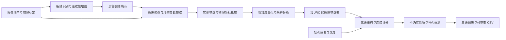

# 架构与处理流程



## 代码结构

```text
src/borehole_fracture/
├── segmentation/      裂隙识别、后处理、训练和评价
├── geometry/          连通域、中心线和正弦参数拟合
├── roughness/         三种采样策略与 Z2/JRC 计算
├── reconstruction/    三维平面、连接评分、补孔规划与绘图
├── contracts.py       标定、图像清单和钻孔表
├── io.py              掩码极性、图像和表格读写
├── workflows.py       独立阶段与完整流程编排
└── cli.py             统一命令入口
```

算法模块使用数组、参数表和物理坐标，不读取固定的本机路径。CLI 负责路径和参数，`workflows` 负责阶段间数据交接。TensorFlow 在训练或 U-Net 推理时才加载，经典图像处理与三维分析可独立使用。

每次完整运行按四个阶段保存中间结果，`run.json` 记录输入路径、模型和采样点数；标定信息随每条裂隙保留。可以编辑分割掩码或筛选参数表，从相应阶段重新执行。
